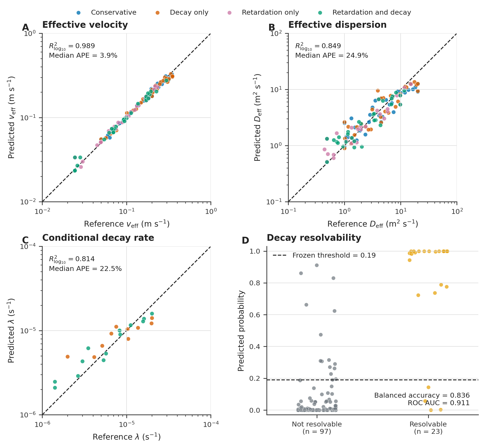
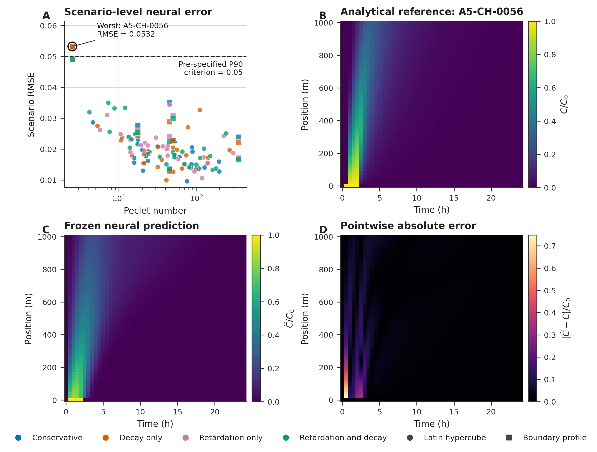
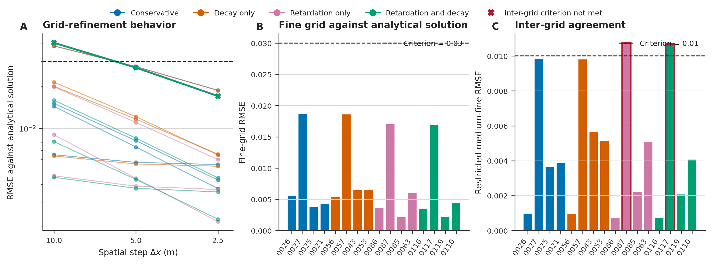
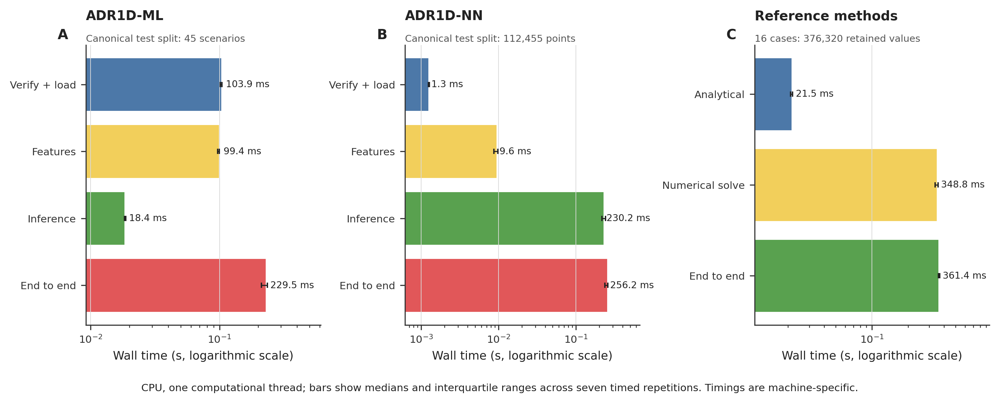
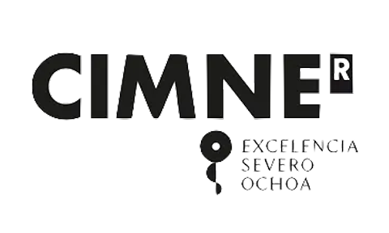

# ADR1D-Validation :droplet:

<div align="center">

[](https://github.com/gstinoco/ADR1D-Validation) [](https://www.python.org/) [](https://numpy.org/) [](https://scipy.org/) [](results/adr1d_numerical_validation_en.pdf) [](#page_facing_up-technical-report) [](configs/validation_protocol.json) [](#white_check_mark-validation--reproducibility) [](LICENSE) [](LICENSE-CONTENT)

**Independent numerical validation of ADR1D-ML and ADR1D-NN for one-dimensional reactive contaminant transport.**

*A reproducible technical report, locked challenge set, persisted predictions, traditional finite-volume reference, and read-only audit workflow.*

### :link: Quick Links

[](#rocket-quick-start) [](results/adr1d_numerical_validation_en.pdf) [](#triangular_ruler-validation-design) [](#bar_chart-validation-results) [](#file_cabinet-data--evidence) [](#white_check_mark-validation--reproducibility) [](#memo-how-to-cite) [](#scientist-research-team) [](#factory-industry-partners-supporting-innovation) [](#email-contact--support)

</div>

---

## :clipboard: Table of Contents

- [Overview](#star2-overview)
- [Technical Report](#page_facing_up-technical-report)
- [Repository Structure](#open_file_folder-repository-structure)
- [Installation](#package-installation)
- [Quick Start](#rocket-quick-start)
- [Scientific Formulation](#books-scientific-formulation)
- [Validation Design](#triangular_ruler-validation-design)
- [Data and Evidence](#file_cabinet-data--evidence)
- [Validation Results](#bar_chart-validation-results)
- [Visual Results](#ocean-visual-results)
- [Validation and Reproducibility](#white_check_mark-validation--reproducibility)
- [Data Provenance](#mag-data-provenance)
- [File Integrity](#lock-file-integrity)
- [Limitations](#warning-limitations--responsible-use)
- [Archival Publication and DOI](#card_index_dividers-archival-publication--doi)
- [How to Cite](#memo-how-to-cite)
- [Scientific References](#books-scientific-references)
- [Research Team](#scientist-research-team)
- [Industry Partners](#factory-industry-partners-supporting-innovation)
- [License and Rights](#page_facing_up-license--rights)
- [Acknowledgments](#pray-acknowledgments)
- [Contact and Support](#email-contact--support)
- [FAQ](#speech_balloon-faq)

---

## :star2: Overview

ADR1D-Validation is the public evidence package accompanying the bilingual
technical report **“Independent Numerical Validation of ADR1D-ML and
ADR1D-NN”**. The complete report is distributed in parallel English and
Spanish editions. It examines two distinct learned components for the
one-dimensional advection-dispersion-reaction problem:

- [ADR1D-ML](https://github.com/gstinoco/ADR1D-ML), an inverse model that
  estimates effective transport parameters and decay resolvability from noisy
  sensor histories;
- [ADR1D-NN](https://github.com/gstinoco/ADR1D-NN), a direct neural surrogate
  that estimates normalized concentration when the physical parameters and
  source timing are known.

Both models were frozen before constructing a new analytical challenge set.
The study evaluates them separately, audits their persisted predictions,
compares selected scenarios with an independently implemented finite-volume
solver, and records machine-specific computational cost. The package reports
favorable and unfavorable findings together. In particular, it does not turn
aggregate performance into a claim of uniform local accuracy or universal
speed-up.

### :wrench: Key Capabilities

- **:page_facing_up: Technical reporting:** reviewed 27-page English and
  Spanish editions, each with its complete LaTeX source.
- **:lock: Pre-specified validation:** protocol, challenge, execution contract,
  acceptance criteria, seeds, and chronological lock records.
- **:bar_chart: Persisted evidence:** complete predictions and metric trees for
  ADR1D-ML and ADR1D-NN, including local and scenario-level diagnostics.
- **:triangular_ruler: Numerical comparison:** 48 finite-volume runs over 16
  truth-selected scenarios and three grid levels.
- **:repeat: Independent recalculation:** public scripts that audit results
  without deserializing either model or repeating challenge inference.
- **:art: Publication graphics:** four scientific figures in vector PDF and
  raster PNG formats.
- **:package: Open research package:** text-based data, exact dependencies,
  citation metadata, and separate licenses for code and scholarly content.

### :bar_chart: Release at a Glance

| Item | Value |
|---|---:|
| Challenge scenarios | 120 |
| Physical regimes | 4 |
| Sensor-noise realizations | 600 |
| Sensor observations | 176,400 |
| Analytical field values | 299,880 |
| ADR1D-NN point predictions | 299,880 |
| Bootstrap resamples | 5,000 |
| Numerical-reference scenarios | 16 |
| Finite-volume executions | 48 |
| Scientific figures | 4 PDF + 4 PNG |
| Technical report | 2 language editions, 27 A4 pages each |
| Protocol version | 1.0.0 |
| Report version | 1.1 |
| Package version | 1.0.0 |

---

## :page_facing_up: Technical Report

The principal scientific object is a report available in two equivalent
language editions. The English edition is the preferred citation for an
international archival record; the Spanish edition remains a complete citable
version for technical dissemination:

> **Gerardo Tinoco-Guerrero, Francisco J. Domínguez-Mota, and J. Alberto
> Guzmán-Torres. _Independent Numerical Validation of ADR1D-ML and ADR1D-NN:
> A Reproducible Technical Report_. Version 1.1, Universidad Michoacana de San
> Nicolás de Hidalgo, 2026.**

| Edition or resource | Format | Purpose |
|---|---|---|
| [English report](results/adr1d_numerical_validation_en.pdf) | PDF, A4 | Preferred international reading and archival file |
| [English source](results/adr1d_numerical_validation_en.tex) | LaTeX | Transparent typesetting of the English edition |
| [Spanish report](results/adr1d_validacion_numerica.pdf) | PDF, A4 | Complete Spanish-language technical edition |
| [Spanish source](results/adr1d_validacion_numerica.tex) | LaTeX | Transparent typesetting of the Spanish edition |
| [Citation metadata](CITATION.cff) | CFF 1.2 | Machine-readable software and preferred-report citation |
| [Release manifest](results/release_manifest.json) | JSON | Integrity record for the scientific package |

Both editions contain the same equations, numerical values, figures, tables,
criteria, conclusions, and references. Their labels and citation structure are
checked programmatically, and both PDFs contain 27 A4 pages. Readers may cite
the language edition they actually consulted.

### Report Abstract

This study validates two frozen learned models for one-dimensional reactive
transport using a newly generated, pre-specified analytical challenge set.
ADR1D-ML estimates effective velocity, dispersion, and decay resolvability
from noisy sensor histories. ADR1D-NN predicts the normalized concentration
field from known physical inputs. Results are audited from persisted outputs,
and 16 scenarios are also solved using an independent finite-volume method on
three refinement levels. Both learned models meet the pre-specified aggregate
criteria, while local neural-field errors and false positive decay decisions
remain relevant. The numerical reference agrees with the analytical solution
on the fine grids, although two high-Peclet cases slightly exceed the
medium-to-fine tolerance. Computational times are reported descriptively and
are not interpreted as interchangeable speed-ups across different tasks.

---

## :open_file_folder: Repository Structure

```text
.
|-- README.md
|-- CITATION.cff
|-- LICENSE
|-- LICENSE-CONTENT
|-- requirements.txt
|-- configs/
|   `-- validation_protocol.json
|-- data/
|   |-- challenge_scenarios.csv
|   |-- challenge_analytical_field.csv
|   `-- challenge_sensor_observations.csv
|-- results/
|   |-- adr1d_numerical_validation_en.pdf
|   |-- adr1d_numerical_validation_en.tex
|   |-- adr1d_validacion_numerica.pdf
|   |-- adr1d_validacion_numerica.tex
|   |-- adr1d_ml_challenge_predictions.csv
|   |-- adr1d_ml_challenge_metrics.json
|   |-- adr1d_nn_challenge_predictions.csv
|   |-- adr1d_nn_challenge_scenarios.csv
|   |-- adr1d_nn_challenge_metrics.json
|   |-- numerical_reference_cases.csv
|   |-- numerical_reference_metrics.json
|   |-- computational_cost.json
|   |-- challenge_*.json
|   |-- canonical_reproduction.json
|   |-- figure_manifest.json
|   |-- release_manifest.json
|   `-- figures/
|-- scripts/
|   |-- validate_release.py
|   `-- recalculate_challenge_metrics.py
|-- src/
|   `-- 10 original generation, evaluation, and validation modules
`-- docs/
    |-- team/
    `-- partners/
```

The repository contains no separate documentation files inside `data/`,
`results/`, or `src/`. Their public contracts are maintained here so that a
reader has one authoritative entry point.

---

## :package: Installation

### System Requirements

| Component | Supported configuration |
|---|---|
| Python | 3.12 |
| Operating system | Linux, macOS, or Windows |
| RAM | 8 GB minimum; 16 GB recommended for full metric recalculation |
| Storage | Approximately 90 MB for the repository, plus the virtual environment |
| PDF audit | Poppler `pdfinfo` |
| Report rebuild | A LaTeX distribution with `latexmk` or `pdflatex` |
| Accelerator | Not required; all reported validation used CPU inference |

### Pinned Dependencies

| Package | Version | Role |
|---|---:|---|
| NumPy | 2.0.2 | Numerical arrays and metric reconstruction |
| pandas | 2.2.3 | Tabular challenge evidence |
| SciPy | 1.15.2 | Analytical functions and sparse numerical solver |
| scikit-learn | 1.7.0 | Regression and classification metrics |
| PyTorch | 2.7.1 | Provenance-compatible neural inference environment |
| Matplotlib | 3.10.3 | Scientific figure regeneration |
| Joblib | 1.4.2 | Provenance-compatible ADR1D-ML environment |
| threadpoolctl | 3.6.0 | Computational-cost thread inspection |

### Clone and Install

```bash
git clone https://github.com/gstinoco/ADR1D-Validation.git
cd ADR1D-Validation

python3 -m venv .venv
source .venv/bin/activate  # Windows PowerShell: .venv\Scripts\Activate.ps1

python -m pip install --upgrade pip
python -m pip install -r requirements.txt
```

Install Poppler through the operating-system package manager when `pdfinfo` is
not already available. TeX is optional unless the report PDF will be rebuilt.

### Installation Check

```bash
python scripts/validate_release.py
```

A successful check ends with a compact summary equivalent to:

```json
{
  "artifact_groups": {
    "report": 4
  },
  "deliverable": {
    "figures": 8,
    "report_pages": 27,
    "source_modules": 10
  },
  "english_report": {
    "pages": 27,
    "tables": 11
  },
  "status": "ok"
}
```

The command is read-only and does not load ADR1D-ML or ADR1D-NN.

---

## :rocket: Quick Start

<table>
  <thead>
    <tr>
      <th align="left" width="170">Step</th>
      <th align="left">Command or resource</th>
      <th align="left">Purpose</th>
    </tr>
  </thead>
  <tbody>
    <tr>
      <td><b>1) Read the report</b></td>
      <td><a href="results/adr1d_numerical_validation_en.pdf">English PDF</a> · <a href="results/adr1d_validacion_numerica.pdf">Spanish PDF</a></td>
      <td>Choose either complete language edition to review the methods, diagnostics, interpretation, and limitations.</td>
    </tr>
    <tr>
      <td><b>2) Audit the release</b></td>
      <td><code>python scripts/validate_release.py</code></td>
      <td>Verify the report, data, figures, source modules, metadata, and release manifest.</td>
    </tr>
    <tr>
      <td><b>3) Recalculate metrics</b></td>
      <td><code>python scripts/recalculate_challenge_metrics.py</code></td>
      <td>Rebuild both evidence trees from persisted predictions without model access.</td>
    </tr>
    <tr>
      <td><b>4) Recompute the reference</b></td>
      <td><code>python src/run_numerical_reference.py --output-directory reproduction/numerical_reference</code></td>
      <td>Repeat the 48 finite-volume runs without overwriting canonical evidence.</td>
    </tr>
  </tbody>
</table>

New audit, numerical, and graphical outputs belong under the ignored
`reproduction/` directory. The files under `results/` remain the canonical
historical evidence distributed with version 1.0.0.

---

## :books: Scientific Formulation

### Governing Equation

After retardation scaling, ADR1D represents normalized one-dimensional
reactive transport through

$$
\frac{\partial C}{\partial t}
=D_{\mathrm{eff}}\frac{\partial^2 C}{\partial x^2}
-v_{\mathrm{eff}}\frac{\partial C}{\partial x}
-\lambda C,
$$

where $C$ is concentration, $v_{\mathrm{eff}}$ is effective velocity,
$D_{\mathrm{eff}}$ is effective dispersion, and $\lambda$ is a first-order
decay rate. A finite rectangular inlet pulse is imposed at $x=0$:

$$
\frac{C(0,t)}{C_0}=
\begin{cases}
1, & t_0\leq t<t_0+\tau,\\
0, & \text{otherwise}.
\end{cases}
$$

The [ADR1D benchmark](https://github.com/gstinoco/ADR1D) supplies the analytical
reference and parameter domain. The present repository adds an unseen
challenge set and independent validation evidence; it does not replace the
upstream benchmark.

### Two Different Tasks

| Component | Scientific task | Input unit | Output unit |
|---|---|---|---|
| ADR1D-ML | Inverse parameter estimation | Six noisy sensor histories per realization | Parameters and decay-resolvability probability per scenario |
| ADR1D-NN | Direct field approximation | One physical point and known scenario parameters | Normalized concentration at that point |
| Analytical reference | Closed-form field evaluation | Scenario, position, and time | Reference concentration field |
| Numerical reference | Traditional PDE discretization | Truth-selected scenarios | Grid-based concentration field and convergence diagnostics |

ADR1D-NN receives the **true** physical parameters during this validation. It
does not receive estimates generated by ADR1D-ML. Consequently, the reported
metrics describe two separate model contracts and do not validate an
ADR1D-ML-to-ADR1D-NN chain.

### Physical Regimes

The 120 challenge scenarios are balanced across four regimes:

| Regime | Retardation | Decay | Scenarios |
|---|---:|---:|---:|
| `conservative` | No | No | 30 |
| `decay_only` | No | Yes | 30 |
| `retardation_only` | Yes | No | 30 |
| `retardation_and_decay` | Yes | Yes | 30 |

Each regime contains 24 Latin-hypercube interior samples and six predefined
boundary profiles. This design tests both representative combinations and
deliberately difficult edges of the ADR1D parameter domain.

---

## :triangular_ruler: Validation Design

### Pre-Specified Chronology

The sequence was fixed to keep validation decisions separate from observed
challenge performance:

| Stage | Action | Model access |
|---|---|---:|
| 1 | Lock protocol, metrics, criteria, seeds, and numerical method | None |
| 2 | Generate 120 challenge scenarios and all analytical values | None |
| 3 | Independently reconstruct and validate the challenge set | None |
| 4 | Lock exact model inputs, code identities, and run limits | None |
| 5 | Execute one persisted challenge inference per frozen model | One per model |
| 6 | Recalculate evidence from persisted predictions | None |
| 7 | Solve 16 truth-selected cases with three numerical grids | None |
| 8 | Measure 11 documented workloads on one CPU thread | Canonical data only |
| 9 | Generate figures and compile the report | None |

No model retraining, threshold tuning, or post-challenge correction was
performed. The challenge run count is preserved in the metric records.

### Challenge Construction

- **Base scenarios:** 120, with 30 per physical regime.
- **Interior design:** 96 Latin-hypercube samples.
- **Boundary design:** 24 fixed profiles, six per regime.
- **Spatial grid:** 51 positions from 0 to 1,000 m.
- **Temporal grid:** 49 times over 24 h at 1,800 s intervals.
- **Sensor positions:** 100, 250, 400, 600, 800, and 1,000 m.
- **Noise replicates:** five per base scenario.
- **Bootstrap:** 5,000 resamples clustered by base scenario.
- **Parameter seed:** 2026072105.
- **Noise seed:** 2026072106.
- **Bootstrap seed:** 2026072107.

The independent challenge validator reconstructed the scenario design,
analytical field, censoring, and noise sequence without importing the generator
or either model. The maximum absolute difference from the reconstructed field
was approximately $5.0\times10^{-12}$ mg/L. No challenge identifier or
parameter vector duplicated the 300 canonical ADR1D scenarios at the locked
tolerance.

### Statistical Unit and Metrics

The base scenario is the independent sampling unit. Five sensor-noise
realizations are nested within each ADR1D-ML scenario and are aggregated before
the main metrics are calculated. ADR1D-NN point errors are also summarized by
scenario so that the 299,880 space-time points are not treated as independent
experimental units.

Primary metric families include:

- log-scale regression error and relative error for positive parameters;
- balanced accuracy, ROC AUC, precision, recall, and confusion matrix for
  decay resolvability;
- pooled and active-region RMSE, $R^2$, scenario RMSE, mass error, and arrival
  error for the neural field;
- analytical RMSE, medium-to-fine RMSE, positivity, and discrete mass balance
  for the traditional numerical reference;
- cluster-bootstrap 95% confidence intervals for model-level summaries.

### Traditional Numerical Reference

Sixteen scenarios were selected from truth parameters only, four per regime.
Each was solved with a cell-centered finite-volume method using
Scharfetter-Gummel fluxes and backward Euler time integration. The computational
domain extends to 1,200 m, while comparison is restricted to the first 900 m to
reduce the influence of the artificial outlet. Source switching times are
inserted exactly into the time grid.

| Level | Spatial step | Maximum time step |
|---|---:|---:|
| Coarse | 20 m | 450 s |
| Medium | 10 m | 225 s |
| Fine | 5 m | 112.5 s |

---

## :file_cabinet: Data & Evidence

All scientific tables use CSV and all structured reports use JSON. No
proprietary workbook is required.

### Core Tables

| File | Rows | Columns | Content |
|---|---:|---:|---|
| [`data/challenge_scenarios.csv`](data/challenge_scenarios.csv) | 120 | 23 | Scenario parameters, dimensionless groups, design labels, and source timing |
| [`data/challenge_analytical_field.csv`](data/challenge_analytical_field.csv) | 299,880 | 8 | Analytical concentration on every challenge space-time point |
| [`data/challenge_sensor_observations.csv`](data/challenge_sensor_observations.csv) | 176,400 | 14 | True, noisy, censored sensor observations for five replicates |
| [`results/adr1d_ml_challenge_predictions.csv`](results/adr1d_ml_challenge_predictions.csv) | 600 | 17 | ADR1D-ML predictions for each noise realization |
| [`results/adr1d_nn_challenge_predictions.csv`](results/adr1d_nn_challenge_predictions.csv) | 299,880 | 12 | Reference and predicted normalized concentration at every point |
| [`results/adr1d_nn_challenge_scenarios.csv`](results/adr1d_nn_challenge_scenarios.csv) | 120 | 20 | Scenario-level neural-field diagnostics |
| [`results/numerical_reference_cases.csv`](results/numerical_reference_cases.csv) | 48 | 26 | Numerical metrics for 16 scenarios on three grid levels |

### Challenge Scenario Dictionary

| Column group | Fields | Meaning |
|---|---|---|
| Identity | `scenario_id`, `split`, `regime` | Stable case identifier, challenge label, and physical regime |
| Design | `design_component`, `design_index` | Interior Latin-hypercube or boundary-profile origin |
| Grid | `domain_length_m`, `spatial_nodes`, `spatial_step_m`, `final_time_s`, `time_nodes`, `time_step_s` | Space-time domain and tabulation |
| Transport | `velocity_m_s`, `dispersion_m2_s`, `retardation_factor`, `decay_rate_s_1` | Unscaled physical parameters |
| Source | `source_concentration_mg_L`, `source_start_s`, `source_duration_s`, `source_end_s` | Rectangular inlet pulse |
| Diagnostics | `dispersivity_m`, `peclet_number`, `damkohler_number`, `advective_travel_time_s` | Derived physical quantities |

Effective quantities used by the models satisfy
$v_{\mathrm{eff}}=v/R$ and $D_{\mathrm{eff}}=D/R$.

### Analytical Field Dictionary

| Field | Unit | Description |
|---|---|---|
| `scenario_id` | none | Parent challenge case |
| `time_s` | s | Elapsed physical time |
| `x_m` | m | Position along the domain |
| `concentration_mg_L` | mg/L | Analytical concentration |
| `normalized_concentration` | none | $C/C_0$ analytical reference |
| `regime`, `design_component`, `split` | none | Grouping and provenance labels |

### Sensor Observation Dictionary

| Field | Unit | Description |
|---|---|---|
| `observation_id` | none | Stable row identifier |
| `base_scenario_id` | none | Independent bootstrap unit |
| `scenario_id`, `replicate_id` | none | Noise-realization identifier |
| `sensor_id`, `x_m`, `time_s` | none, m, s | Sensor and sampling coordinates |
| `concentration_true_mg_L` | mg/L | Analytical value before noise |
| `noise_std_mg_L` | mg/L | Heteroscedastic noise standard deviation |
| `concentration_observed_mg_L` | mg/L | Non-negative observed concentration |
| `detection_limit_mg_L` | mg/L | Locked analytical detection limit |
| `is_below_detection_limit` | Boolean | Censoring indicator |

### Prediction and Diagnostic Fields

ADR1D-ML output preserves true and predicted effective velocity and dispersion,
the decay-resolvability probability and class, and conditional decay estimates
for each realization. The scenario-level aggregation uses geometric means for
positive parameter regressions and an arithmetic mean for probability before
applying the locked 0.19 decision threshold.

ADR1D-NN output preserves the analytical and predicted normalized
concentration, absolute error, physical regime, dimensionless groups, and the
hard constraint applied at each point. The scenario table adds active-region
errors, integrated-mass error, arrival-time error, a discrete PDE residual,
and exact initial- and inlet-condition checks.

### Structured Evidence

| JSON artifact | Purpose |
|---|---|
| [`validation_protocol.json`](configs/validation_protocol.json) | Locked design, criteria, seeds, and frozen inputs |
| [`validation_protocol_lock.json`](results/validation_protocol_lock.json) | State recorded before challenge generation |
| [`challenge_manifest.json`](results/challenge_manifest.json) | Generated challenge dimensions and artifact records |
| [`challenge_validation.json`](results/challenge_validation.json) | Independent pre-inference challenge reconstruction |
| [`challenge_lock.json`](results/challenge_lock.json) | Guard established before model access |
| [`challenge_evaluation_lock.json`](results/challenge_evaluation_lock.json) | Exact model-input and execution contract |
| [`canonical_reproduction.json`](results/canonical_reproduction.json) | Reproduction of the previously published canonical evaluations |
| [`challenge_result_validation.json`](results/challenge_result_validation.json) | Independent recalculation from persisted predictions |
| [`adr1d_ml_challenge_metrics.json`](results/adr1d_ml_challenge_metrics.json) | Complete inverse-model evidence tree |
| [`adr1d_nn_challenge_metrics.json`](results/adr1d_nn_challenge_metrics.json) | Complete neural-field evidence tree |
| [`numerical_reference_metrics.json`](results/numerical_reference_metrics.json) | Selection, convergence, balance, and acceptance results |
| [`computational_cost.json`](results/computational_cost.json) | Environment, timing policy, workload summaries, and limitations |
| [`figure_manifest.json`](results/figure_manifest.json) | Figure inputs, selection rule, and integrity records |
| [`release_manifest.json`](results/release_manifest.json) | Public package integrity record |

---

## :bar_chart: Validation Results

### ADR1D-ML: Inverse Parameter Model

ADR1D-ML met all pre-specified aggregate criteria. Velocity was estimated more
accurately than dispersion, while conditional decay estimation remained
possible for the 23 truth-resolvable scenarios.

| Metric | Observed | Criterion | Outcome |
|---|---:|---:|:---:|
| Median relative error, effective velocity | 3.95% | at most 10% | Pass |
| 90th percentile relative error, effective velocity | 10.87% | at most 25% | Pass |
| Log-scale $R^2$, effective velocity | 0.9892 | at least 0.90 | Pass |
| Median relative error, effective dispersion | 24.94% | at most 40% | Pass |
| 90th percentile relative error, effective dispersion | 65.81% | at most 100% | Pass |
| Log-scale $R^2$, effective dispersion | 0.8494 | at least 0.50 | Pass |
| Decay-resolvability balanced accuracy | 0.8357 | at least 0.65 | Pass |
| Decay-resolvability ROC AUC | 0.9113 | at least 0.70 | Pass |

The decay-resolvability confusion matrix contained 82 true negatives, 15 false
positives, four false negatives, and 19 true positives. Precision was 0.5588.
This means that a positive class should be interpreted together with its
probability and intended use, not as an unqualified physical detection.

### ADR1D-NN: Direct Neural Field

ADR1D-NN also met all 12 pre-specified aggregate criteria. It produced no
values below zero or above one and exactly respected the initial and inlet
conditions imposed by its public interface.

| Metric | Observed | Criterion | Outcome |
|---|---:|---:|:---:|
| Global normalized RMSE | 0.02258 | at most 0.035 | Pass |
| Active-region normalized RMSE | 0.03887 | at most 0.065 | Pass |
| Global $R^2$ | 0.98937 | at least 0.97 | Pass |
| 90th percentile scenario RMSE | 0.03100 | at most 0.05 | Pass |
| Median integrated-mass relative error | 1.74% | at most 10% | Pass |
| 90th percentile integrated-mass relative error | 7.82% | at most 25% | Pass |
| Median arrival-time absolute error | 1,800 s | at most 1,800 s | Pass |
| 90th percentile arrival-time absolute error | 1,800 s | at most 3,600 s | Pass |

The favorable pooled metrics do not imply a uniform error field. The maximum
point error was 0.74945 near source activation at the first interior position,
and the worst scenario RMSE was 0.05323. These localized differences are why
the report includes field, profile, and scenario diagnostics in addition to
global averages.

### Traditional Numerical Reference

The finite-volume solution improved monotonically under refinement for all 16
selected scenarios, and every fine-grid comparison met the analytical RMSE
tolerance.

| Diagnostic | Observed | Criterion | Outcome |
|---|---:|---:|:---:|
| Median fine-grid RMSE | 0.00546 | descriptive | Pass |
| Maximum fine-grid RMSE | 0.01867 | at most 0.03 per case | Pass |
| Maximum medium-to-fine RMSE | 0.01074 | at most 0.01 per case | Mixed |
| Minimum normalized concentration | 0.0 | at least $-10^{-10}$ | Pass |
| Maximum absolute mass-balance residual | $4.45\times10^{-13}$ | diagnostic | Pass |

Fourteen of 16 scenarios met every criterion. Two cases at Peclet number 350,
`A5-CH-0117` and `A5-CH-0087`, exceeded the medium-to-fine tolerance by about
6.9% and 7.4%, respectively. The aggregate numerical conclusion is therefore
reported as **mixed evidence**, even though both fine-grid analytical errors
remained acceptable.

### Computational Cost

All timings were measured on one Apple arm64 machine under a one-thread CPU
policy, with seven timed repetitions after two warm-up runs.

| Workload | Median time | Scientific unit |
|---|---:|---|
| ADR1D-ML end to end | 0.22954 s | 45 canonical scenarios |
| ADR1D-NN end to end | 0.25623 s | 112,455 canonical points |
| Analytical evaluation | 0.02150 s | 376,320 values |
| Traditional numerical solution | 0.34884 s | 376,320 retained values |
| Numerical reference end to end | 0.36136 s | 376,320 analytical-numerical pairs |

Input tables were resident in memory before timing, and CSV parsing and output
serialization were excluded. The workloads solve different scientific tasks
and have different cardinalities. Their raw times must not be converted into a
single universal speed-up claim.

---

## :ocean: Visual Results

### Parameter Estimation and Decay Resolvability

<div align="center">



<sub>Observed versus predicted effective parameters, decay-resolvability behavior, and error by physical regime.</sub>

</div>

### Neural Concentration Field

<div align="center">



<sub>The worst scenario by persisted RMSE is shown to expose localized discrepancies that pooled metrics can hide.</sub>

</div>

### Numerical Convergence

<div align="center">



<sub>Analytical error decreases with refinement; the highlighted high-Peclet cases retain the medium-to-fine tolerance misses.</sub>

</div>

### Computational Workloads

<div align="center">



<sub>Machine-specific descriptive timings. Bars do not represent equivalent scientific tasks.</sub>

</div>

Vector versions suitable for typesetting are available beside each PNG in
[`results/figures/`](results/figures/).

---

## :white_check_mark: Validation & Reproducibility

### Level 1: Self-Contained Release Validation

```bash
python scripts/validate_release.py
```

This read-only check does not load either model. It verifies the release
manifest, scientific status records, selected report values, CSV row counts,
eight figure files, 10 source modules, both 27-page report editions, citation
metadata, license files, and path portability. A successful run ends with
`"status": "ok"`.

### Level 2: Complete Metric Recalculation

```bash
python scripts/recalculate_challenge_metrics.py
```

This command reads the persisted predictions, repeats both 5,000-resample
cluster bootstraps, reconstructs the ADR1D-NN scenario diagnostics, and compares
the complete recalculated evidence trees with the distributed metric reports.
It does not deserialize a model or perform inference. Its output is written to
`reproduction/challenge_metric_recalculation.json`.

The calculation is intentionally more expensive than the release audit. The
distributed reference audit completed 2,664 logical checks, compared 2,423
numerical values, and found a maximum absolute difference of approximately
$8.92\times10^{-13}$.

### Level 3: Traditional Numerical Reference

```bash
python src/run_numerical_reference.py \
  --output-directory reproduction/numerical_reference
```

The command selects the same 16 cases from truth parameters and performs 48
finite-volume solves. Runtime metadata will naturally differ across machines;
the physical and numerical summaries should remain within the documented
tolerances.

### Regenerate the Scientific Figures

```bash
python src/generate_validation_figures.py \
  --output-directory reproduction/figures \
  --manifest reproduction/figure_manifest.json
```

Figure generation reads only persisted CSV and JSON evidence. It does not load
models or execute inference. Outputs are directed away from the canonical
`results/` directory.

### Rebuild the Technical Report

Both LaTeX sources resolve figure paths relative to `results/`, so build them
from that directory:

```bash
cd results
latexmk -pdf -interaction=nonstopmode -halt-on-error adr1d_numerical_validation_en.tex
latexmk -pdf -interaction=nonstopmode -halt-on-error adr1d_validacion_numerica.tex
latexmk -c adr1d_numerical_validation_en.tex
latexmk -c adr1d_validacion_numerica.tex
cd ..
```

The distributed PDFs use fixed build dates and distinct trailer identifiers to
support deterministic reconstruction. LaTeX engine, font, and package
differences can still affect binary equality on another installation;
scientific content and page rendering should therefore also be inspected.

### Reproducibility Boundaries

| Scope | Self-contained here? | Model execution? | Canonical evidence modified? |
|---|:---:|:---:|:---:|
| Release integrity and report audit | Yes | No | No |
| Complete metric recalculation from predictions | Yes | No | No |
| Numerical reference | Yes | No | No |
| Figure regeneration | Yes | No | No |
| Original one-time challenge inference | Provenance code only | Yes | Must not be repeated in place |
| Model retraining | No; use upstream repositories | Yes | No |

The ten modules in `src/` are retained unchanged as provenance for the original
locked campaign. Some orchestration modules resolve the relative upstream
paths frozen in the protocol and require the corresponding archival ADR1D,
ADR1D-ML, and ADR1D-NN workspace. They are not the public quick-start commands.
The distributed predictions are the immutable evidence from the permitted
one-time challenge evaluations.

---

## :mag: Data Provenance

### Upstream Works

| Project | Role | Public repository |
|---|---|---|
| ADR1D v1.0.0 | Analytical benchmark and canonical parameter domain | [gstinoco/ADR1D](https://github.com/gstinoco/ADR1D) |
| ADR1D-ML v1.0.0 | Frozen inverse parameter model | [gstinoco/ADR1D-ML](https://github.com/gstinoco/ADR1D-ML) |
| ADR1D-NN v1.0.0 | Frozen direct neural surrogate | [gstinoco/ADR1D-NN](https://github.com/gstinoco/ADR1D-NN) |

The challenge data are newly generated synthetic evidence. No Water Quality
Portal records or other field observations are included or used for the
reported validation metrics.

---

## :lock: File Integrity

Cryptographic digests are kept in machine-readable manifests and lock files
because they support operational checks. They are not reproduced as long
tables in this README, and a matching digest must not be interpreted as proof
of scientific validity by itself.

The public [`release_manifest.json`](results/release_manifest.json) covers 20
core evidence files, eight figures, four report files, and 10 original source
modules. The release validator checks those records and then applies semantic
tests to statuses, dimensions, key results, equivalence between language
editions, citation metadata, and licenses.

The only publication-specific normalization applied to the evidence was the
replacement of local absolute path labels in `computational_cost.json` with
portable repository and upstream labels. Before/after digests, timings,
environment metadata, measurements, and scientific conclusions were not
changed. The corresponding source digest in `figure_manifest.json` was updated
to describe this portable copy.

---

## :warning: Limitations & Responsible Use

- **Synthetic domain:** all confirmatory challenge cases follow the ADR1D
  equation, parameter intervals, geometry, and source family.
- **No field validation:** the evidence does not establish performance for a
  real aquifer, monitoring network, or contaminant plume.
- **No extrapolation claim:** behavior outside the locked ADR1D ranges was not
  evaluated.
- **Separate models:** ADR1D-NN received true parameters; propagation of
  ADR1D-ML errors through the neural field remains untested.
- **Rectangular source:** instantaneous source switching contributes to the
  largest local neural errors near the inlet and activation time.
- **Decay observability:** resolvability is an operational benchmark definition
  that combines signal, noise, censoring, and a Damkohler threshold. It is not
  a universal experimental detection limit.
- **Localized error:** global RMSE and $R^2$ do not replace scenario, front,
  boundary, or maximum-error inspection.
- **Numerical evidence:** two high-Peclet cases retain small medium-to-fine
  tolerance misses; this outcome must remain visible.
- **Machine-specific cost:** timings and traced Python allocations do not
  generalize automatically to other hardware or native-library memory use.
- **No regulatory use:** the package is a research benchmark and validation
  record, not a water-quality standard, site assessment, or decision system.

Any extension should preserve the study order: specify the protocol, freeze
artifacts and criteria, evaluate unseen cases once, retain unfavorable results,
and report local physical diagnostics alongside aggregate metrics.

---

## :card_index_dividers: Archival Publication & DOI

This repository is organized for a **manual Zenodo deposit classified as a
technical report**, because the reviewed report is the principal scholarly
object and the code and data serve as supporting evidence. A manual deposit
also allows the DOI to be reserved before publication and then inserted into
the PDF and citation metadata.

The archival record should contain:

1. `results/adr1d_numerical_validation_en.pdf` as the principal international file;
2. `results/adr1d_validacion_numerica.pdf` as the complete Spanish edition;
3. the tagged GitHub release archive as the complete reproducibility package;
4. both LaTeX sources for source-level preservation;
5. the three principal investigators as creators, in the order used here;
6. resource type **Technical report**, publication year 2026, and CC BY 4.0
   for the report-centered Zenodo record.

The root `CITATION.cff` describes the repository as software while identifying
the report as the preferred citation. This preserves the MIT license for code
and the CC BY 4.0 license for scholarly content. Once an archival DOI is part
of a released record, that DOI should be added to `CITATION.cff`, the report,
and the citation section below before the corresponding GitHub release is
treated as final.

---

## :memo: How to Cite

### Preferred English Technical-Report Citation

Tinoco-Guerrero, G., Domínguez-Mota, F. J., and Guzmán-Torres, J. A. (2026).
*Independent Numerical Validation of ADR1D-ML and ADR1D-NN: A Reproducible
Technical Report*. Version 1.1. Universidad Michoacana de San Nicolás de Hidalgo.
https://github.com/gstinoco/ADR1D-Validation

```bibtex
@techreport{TinocoGuerrero2026ADR1DValidation,
  author      = {Tinoco-Guerrero, Gerardo and
                 Domínguez-Mota, Francisco J. and
                 Guzmán-Torres, J. Alberto},
  title       = {Independent Numerical Validation of ADR1D-ML and ADR1D-NN:
                 A Reproducible Technical Report},
  institution = {Universidad Michoacana de San Nicolás de Hidalgo},
  year        = {2026},
  note        = {Version 1.1; English edition},
  url         = {https://github.com/gstinoco/ADR1D-Validation}
}
```

### Spanish Edition

Tinoco-Guerrero, G., Domínguez-Mota, F. J., and Guzmán-Torres, J. A. (2026).
*Validación numérica independiente de ADR1D-ML y ADR1D-NN: Informe técnico
reproducible*. Version 1.1. Universidad Michoacana de San Nicolás de Hidalgo.
https://github.com/gstinoco/ADR1D-Validation

The two citations identify language editions of the same technical report, not
separate validation studies. Cite the edition consulted and use the eventual
archival DOI once it has been assigned.

Please also cite the specific upstream work used in an analysis:

- [ADR1D](https://github.com/gstinoco/ADR1D) for the analytical benchmark;
- [ADR1D-ML](https://github.com/gstinoco/ADR1D-ML) for inverse parameter
  inference;
- [ADR1D-NN](https://github.com/gstinoco/ADR1D-NN) for neural field inference.

Machine-readable citation metadata are provided in [`CITATION.cff`](CITATION.cff).

---

## :books: Scientific References

### :books: Core Publications

1. Ogata, A., and Banks, R. B. (1961). *A solution of the differential
   equation of longitudinal dispersion in porous media*. U.S. Geological
   Survey Professional Paper 411-A.
   [https://doi.org/10.3133/pp411A](https://doi.org/10.3133/pp411A)
2. Chen, J.-S., and Liu, C.-W. (2011). Generalized analytical solution for
   advection-dispersion equation in finite spatial domain with arbitrary
   time-dependent inlet boundary condition. *Hydrology and Earth System
   Sciences*, 15, 2471-2479.
   [https://doi.org/10.5194/hess-15-2471-2011](https://doi.org/10.5194/hess-15-2471-2011)
3. McKay, M. D., Beckman, R. J., and Conover, W. J. (1979). A comparison of
   three methods for selecting values of input variables in the analysis of
   output from a computer code. *Technometrics*, 21(2), 239-245.
   [https://doi.org/10.1080/00401706.1979.10489755](https://doi.org/10.1080/00401706.1979.10489755)
4. Scharfetter, D. L., and Gummel, H. K. (1969). Large-signal analysis of a
   silicon Read diode oscillator. *IEEE Transactions on Electron Devices*,
   16(1), 64-77.
   [https://doi.org/10.1109/T-ED.1969.16566](https://doi.org/10.1109/T-ED.1969.16566)
5. Efron, B., and Tibshirani, R. J. (1993). *An Introduction to the
   Bootstrap*. Chapman & Hall/CRC.

The technical report contains the complete bibliography and explains how each
reference supports the analytical solution, challenge design, finite-volume
flux, or uncertainty analysis.

### :trophy: Project Highlights

- **Pre-specified challenge campaign** with models, thresholds, metrics, and
  acceptance criteria frozen before inference.
- **Two complete evidence trees** independently recalculated from 600 inverse
  predictions and 299,880 neural field predictions.
- **Traditional numerical cross-check** retaining both successful convergence
  and the two high-Peclet tolerance misses.
- **Open technical report package** combining methods, data, code, figures,
  licenses, and citation metadata in one auditable release.
- **Non-destructive public workflows** that direct every new calculation to an
  ignored reproduction directory.

---

## :scientist: Research Team

<div align="center">

### :star2: Meet the Team

*Researchers and students advancing reproducible numerical modeling and scientific machine learning for reactive transport*

</div>

### :busts_in_silhouette: Main Researchers

<table align="center">
  <thead>
    <tr>
      <th align="center" width="120">Photo</th>
      <th align="left">Researcher</th>
      <th align="left">Affiliation</th>
      <th align="left">Contact</th>
    </tr>
  </thead>
  <tbody>
    <tr>
      <td align="center"></td>
      <td><b>Gerardo Tinoco-Guerrero</b><br/><sub>Numerical methods and environmental modeling</sub></td>
      <td><a href="https://umich.mx/"></a></td>
      <td><a href="mailto:gerardo.tinoco@umich.mx"></a><br/><a href="https://orcid.org/0000-0003-3119-770X"></a></td>
    </tr>
    <tr>
      <td align="center"></td>
      <td><b>Francisco J. Domínguez-Mota</b><br/><sub>Applied mathematics and numerical methods</sub></td>
      <td><a href="https://umich.mx/"></a></td>
      <td><a href="mailto:francisco.mota@umich.mx"></a><br/><a href="https://orcid.org/0000-0001-6837-172X"></a></td>
    </tr>
    <tr>
      <td align="center"></td>
      <td><b>J. Alberto Guzmán-Torres</b><br/><sub>Engineering applications and artificial intelligence</sub></td>
      <td><a href="https://umich.mx/"></a></td>
      <td><a href="mailto:jose.alberto.guzman@umich.mx"></a><br/><a href="https://orcid.org/0000-0002-9309-9390"></a></td>
    </tr>
  </tbody>
</table>

### :mortar_board: Ph.D. Research Students

<table align="center">
  <thead>
    <tr>
      <th align="center" width="120">Photo</th>
      <th align="left">Student</th>
      <th align="left">Institution</th>
      <th align="left">Contact</th>
    </tr>
  </thead>
  <tbody>
    <tr>
      <td align="center"></td>
      <td><b>Gabriela Pedraza-Jiménez</b><br/></td>
      <td><a href="https://umich.mx/"></a></td>
      <td><a href="mailto:2220157h@umich.mx"></a></td>
    </tr>
    <tr>
      <td align="center"></td>
      <td><b>Eli Chagolla-Inzunza</b><br/></td>
      <td><a href="https://umich.mx/"></a></td>
      <td><a href="mailto:1137626b@umich.mx"></a></td>
    </tr>
  </tbody>
</table>

### :mortar_board: M.Sc. Research Students

<table align="center">
  <thead>
    <tr>
      <th align="center" width="120">Photo</th>
      <th align="left">Student</th>
      <th align="left">Institution</th>
      <th align="left">Contact</th>
    </tr>
  </thead>
  <tbody>
    <tr>
      <td align="center"></td>
      <td><b>Jorge L. González-Figueroa</b><br/></td>
      <td><a href="https://umich.mx/"></a></td>
      <td><a href="mailto:1718717h@umich.mx"></a></td>
    </tr>
    <tr>
      <td align="center"></td>
      <td><b>Christopher N. Magaña-Barocio</b><br/></td>
      <td><a href="https://umich.mx/"></a></td>
      <td><a href="mailto:1339846k@umich.mx"></a></td>
    </tr>
  </tbody>
</table>

### :mortar_board: Undergraduate Research Students

<table align="center">
  <thead>
    <tr>
      <th align="center" width="120">Photo</th>
      <th align="left">Student</th>
      <th align="left">Institution</th>
      <th align="left">Contact</th>
    </tr>
  </thead>
  <tbody>
    <tr>
      <td align="center"></td>
      <td><b>Maria Goretti Fraga-Lopez</b><br/></td>
      <td><a href="https://umich.mx/"></a></td>
      <td><a href="mailto:1702174b@umich.mx"></a></td>
    </tr>
  </tbody>
</table>

Student contributors are acknowledged for their participation in the broader
research program. Formal report citation, software metadata, and copyright
attribution remain limited to the three principal researchers listed in
`CITATION.cff` and the license files.

---

## :factory: Industry Partners Supporting Innovation

<div align="center">

### :star2: Academic-Industry Collaboration

*Connecting reproducible numerical validation with applied engineering and technology transfer*

</div>

<table align="center" width="70%">
  <tr>
    <td valign="top" style="border: 1px solid #d0d7de; border-radius: 8px; padding: 16px;">
      <div align="center">
        <a href="https://www.siiia.com.mx/"></a><br/><br/>
        <b>SIIIA MATH</b><br/>
        <sub>Soluciones en Ingeniería</sub><br/><br/>
        <a href="https://www.siiia.com.mx/"></a>
        
      </div>
      <br/>
      <b>Focus areas</b>
      <ul>
        <li>Mathematical modeling and scientific computing</li>
        <li>Machine-learning support for environmental transport applications</li>
        <li>Applied research, development, and technology transfer</li>
      </ul>
    </td>
  </tr>
</table>

---

## :page_facing_up: License & Rights

ADR1D-Validation uses a component-specific licensing scheme:

- **Source code:** MIT License, provided in [`LICENSE`](LICENSE).
- **Technical report, challenge data, derived tables, and scientific figures:**
  Creative Commons Attribution 4.0 International, provided in
  [`LICENSE-CONTENT`](LICENSE-CONTENT).
- **ADR1D, ADR1D-ML, and ADR1D-NN:** remain subject to the licenses and
  attribution statements in their respective repositories.
- **Profile images:** files under `docs/team/` are excluded from both licenses
  and remain subject to the rights of the people depicted and their rights
  holders.
- **Institutional emblems and logos:** files under `docs/partners/` remain the
  property of their respective organizations. They are used only for
  identification and acknowledgment and are not covered by MIT or CC BY 4.0.
- **Third-party libraries:** retain their respective licenses; listing a
  dependency does not redistribute its source code.

Copyright and formal citation identify Gerardo Tinoco-Guerrero, Francisco J.
Domínguez-Mota, and J. Alberto Guzmán-Torres as the principal investigators.
The package is provided without warranty. Attribution must not imply
endorsement by the authors, UMSNH, SECIHTI, CIC-UMSNH, CIMNE, Aula CIMNE
Morelia, or SIIIA MATH.

---

## :pray: Acknowledgments

<div align="center">

### :heart: Special Thanks

*We thank the institutions and partners whose continuing support made the modeling, validation, documentation, and student participation possible.*

</div>

### :classical_building: Institutional Support

<table align="center" width="100%" cellspacing="12">
  <tr>
    <td width="50%" valign="top" style="border: 1px solid #d0d7de; border-radius: 8px; padding: 16px;">
      <div align="center">
        <a href="https://umich.mx/"></a><br/><br/>
        <b>Universidad Michoacana de San Nicolás de Hidalgo</b><br/>
        <sub>UMSNH · Academic institution · Mexico</sub><br/><br/>
        <a href="https://umich.mx/"></a>
        
        
      </div>
      <br/>
      <b>Support provided</b>
      <ul>
        <li>Research infrastructure and institutional backing</li>
        <li>Academic supervision and undergraduate and graduate training</li>
      </ul>
    </td>
    <td width="50%" valign="top" style="border: 1px solid #d0d7de; border-radius: 8px; padding: 16px;">
      <div align="center">
        <a href="https://secihti.mx/"></a><br/><br/>
        <b>Secretaría de Ciencia, Humanidades, Tecnología e Innovación</b><br/>
        <sub>SECIHTI · Federal science agency · Mexico</sub><br/><br/>
        <a href="https://secihti.mx/"></a>
        
        
      </div>
      <br/>
      <b>Support provided</b>
      <ul>
        <li>Financial support for scientific and technological research</li>
        <li>Promotion of knowledge generation and public dissemination</li>
      </ul>
    </td>
  </tr>
  <tr>
    <td width="50%" valign="top" style="border: 1px solid #d0d7de; border-radius: 8px; padding: 16px;">
      <div align="center">
        <a href="https://cimne.com/"></a><br/><br/>
        <b>International Centre for Numerical Methods in Engineering</b><br/>
        <sub>CIMNE · Research center and international collaboration</sub><br/><br/>
        <a href="https://cimne.com/"></a>
        
        
      </div>
      <br/>
      <b>Support provided</b>
      <ul>
        <li>Collaboration in numerical methods and computational engineering</li>
        <li>Research exchange, training, and international scientific links</li>
      </ul>
    </td>
    <td width="50%" valign="top" style="border: 1px solid #d0d7de; border-radius: 8px; padding: 16px;">
      <div align="center">
        <a href="https://www.siiia.com.mx/"></a><br/><br/>
        <b>SIIIA MATH: Soluciones en Ingeniería</b><br/>
        <sub>Engineering and innovation partner</sub><br/><br/>
        <a href="https://www.siiia.com.mx/"></a>
        
        
      </div>
      <br/>
      <b>Support provided</b>
      <ul>
        <li>Applied research and engineering development</li>
        <li>Financial support and technology-transfer perspective</li>
      </ul>
    </td>
  </tr>
</table>

### :building_with_garden: Research Centers & Collaborations

<table align="center" width="100%" cellspacing="12">
  <tr>
    <td width="50%" valign="top" style="border: 1px solid #d0d7de; border-radius: 8px; padding: 16px;">
      <div align="center">
        <a href="https://aulas.cimne.com/aula/aula-morelia/"></a><br/><br/>
        <b>Aula CIMNE Morelia</b><br/>
        <sub>Research collaboration and training space</sub><br/><br/>
        <a href="https://aulas.cimne.com/aula/aula-morelia/"></a>
        
      </div>
      <br/>
      <b>Collaboration highlights</b>
      <ul>
        <li>Numerical methods and computational engineering environment</li>
        <li>Research exchange and scientific-computing training</li>
      </ul>
    </td>
    <td width="50%" valign="top" style="border: 1px solid #d0d7de; border-radius: 8px; padding: 16px;">
      <div align="center">
        <a href="https://umich.mx/"></a><br/><br/>
        <b>Coordinación de la Investigación Científica</b><br/>
        <sub>CIC-UMSNH · Institutional research coordination</sub><br/><br/>
        <a href="https://umich.mx/"></a>
        
      </div>
      <br/>
      <b>Collaboration highlights</b>
      <ul>
        <li>Institutional coordination for scientific research</li>
        <li>Support for model development, validation, and dissemination</li>
      </ul>
    </td>
  </tr>
</table>

### :computer: Technology Communities

<div align="center">

| Framework | Community | Contribution |
|:---:|:---:|:---:|
| [](https://numpy.org/) | **NumPy Community** | Numerical array operations |
| [](https://pandas.pydata.org/) | **pandas Community** | Tabular data processing |
| [](https://scipy.org/) | **SciPy Community** | Sparse solvers and numerical functions |
| [](https://scikit-learn.org/) | **scikit-learn Community** | Statistical metrics and model interfaces |
| [](https://pytorch.org/) | **PyTorch Community** | Neural-model inference |
| [](https://matplotlib.org/) | **Matplotlib Community** | Scientific visualization |

</div>

---

## :email: Contact & Support

<div align="center">

*Scientific questions, reproducibility reports, and archival-citation support*

[](https://github.com/gstinoco/ADR1D-Validation) [](https://github.com/gstinoco/ADR1D-Validation/issues) [](mailto:gerardo.tinoco@umich.mx)

</div>

<table align="center" width="100%" cellspacing="12">
  <tr>
    <td width="50%" valign="top" style="border: 1px solid #d0d7de; border-radius: 8px; padding: 16px;">
      <div align="center">
        <b>Primary Research Contact</b><br/>
        <sub>Scientific coordination and validation methodology</sub>
      </div>
      <br/>
      <b>Gerardo Tinoco-Guerrero</b><br/>
      <sub>Universidad Michoacana de San Nicolás de Hidalgo<br/>Morelia, Michoacán, Mexico</sub>
      <br/><br/>
      <div align="center">
        <a href="mailto:gerardo.tinoco@umich.mx"></a>
        <a href="https://orcid.org/0000-0003-3119-770X"></a>
        <a href="https://umich.mx/"></a>
      </div>
    </td>
    <td width="50%" valign="top" style="border: 1px solid #d0d7de; border-radius: 8px; padding: 16px;">
      <div align="center">
        <b>Repository Support</b><br/>
        <sub>Questions, reproducibility reports, and documentation problems</sub>
      </div>
      <br/>
      <ul>
        <li>Use GitHub Issues for reproducible software or documentation problems.</li>
        <li>Include the operating system, Python version, exact command, and traceback.</li>
        <li>Report any artifact-integrity failure produced by the release validator.</li>
      </ul>
      <div align="center">
        <a href="https://github.com/gstinoco/ADR1D-Validation/issues"></a>
      </div>
    </td>
  </tr>
</table>

---

## :speech_balloon: FAQ

<details>
<summary><b>Is this repository a new model?</b></summary>

No. It is an independent numerical-validation and evidence package for the
already released ADR1D-ML and ADR1D-NN models.
</details>

<details>
<summary><b>Does the release validator run either predictive model?</b></summary>

No. `scripts/validate_release.py` checks persisted artifacts, the report, and
metadata. `scripts/recalculate_challenge_metrics.py` recalculates metrics from
persisted predictions. Both report zero model loads and zero inference runs.
</details>

<details>
<summary><b>Can I reproduce the finite-volume comparison without the model repositories?</b></summary>

Yes. The challenge scenarios, analytical field, protocol, and numerical solver
required by `src/run_numerical_reference.py` are included here.
</details>

<details>
<summary><b>Why are the full prediction CSV files distributed?</b></summary>

They allow readers to inspect local errors, calculate alternative summaries,
and independently audit the reported metrics without trusting or executing a
serialized model.
</details>

<details>
<summary><b>Why is the numerical outcome described as mixed evidence?</b></summary>

Every fine-grid case met the analytical tolerance, but two high-Peclet cases
slightly missed the stricter medium-to-fine tolerance. The pre-specified rule
requires those misses to remain visible in the aggregate outcome.
</details>

<details>
<summary><b>Are the model timings directly comparable?</b></summary>

No. The inverse model produces scenario-level parameters, the neural surrogate
produces point-level concentrations, and the numerical method produces a grid
solution. Timings describe specific workloads on one machine.
</details>

<details>
<summary><b>Does this validate real groundwater contamination data?</b></summary>

No. The validation is synthetic and restricted to the ADR1D domain. Field
validation requires a separate protocol and data with enough hydraulic,
transport, source, and concentration information to identify the problem.
</details>

<details>
<summary><b>Which citation should I use?</b></summary>

Use the technical report as the preferred citation for these validation
results, then cite ADR1D-ML or ADR1D-NN when using a model directly. The
machine-readable choice is recorded in `CITATION.cff`.
</details>

<details>
<summary><b>Which license applies to a derived figure or table?</b></summary>

Scientific figures, tables, data, and report content are CC BY 4.0. Source code
is MIT. Profile photographs and institutional marks are excluded from both.
</details>

---

<div align="center">

*Independent evidence for reproducible one-dimensional reactive-transport modeling*

[](https://github.com/gstinoco/ADR1D-Validation/stargazers) [](https://github.com/gstinoco/ADR1D-Validation/forks) [](https://github.com/gstinoco/ADR1D-Validation/watchers)

<br/>

[](https://github.com/gstinoco/ADR1D-Validation) [](#memo-how-to-cite) [](LICENSE) [](LICENSE-CONTENT)

<br/>

<b>If this validation package supports your research, please cite the technical report and consider giving the repository a star.</b>

</div>
